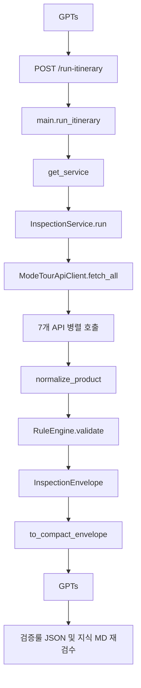

# 현재 요청 흐름

## 근거

- `app/main.py`의 `run_itinerary`
- `app/service.py`의 `InspectionService.run`, `to_compact_envelope`
- `app/client.py`의 `ModeTourApiClient.fetch_all`
- `app/normalizer.py`의 `normalize_product`
- `app/rules.py`의 `RuleEngine.validate`
- `gpts/GPTs_OpenAPI_v2.yaml`의 `/v3/inspections`

## Mermaid

## 현재 계측 상태

Phase 1에서 다음 로그를 추가했다.

- API별 `status_code`, `elapsed_ms`, `content_length`
- raw 응답 byte
- 정규화 후 byte
- compact 응답 byte
- 일정 일수
- 일정 이벤트 수
- GPT 전달 후보 문자열 총 길이
- 동일 텍스트 중복 횟수

## 확인된 구조 리스크

- `fetch_all`은 모든 요청에서 7개 endpoint를 고정 호출한다.
- `/run-itinerary`는 `compact=true`가 기본이지만 `product_point_text[:800]`, `place_names[:8]`, `highlights[:6]`처럼 근거를 임의 절단한다.
- `RuleEngine.validate`는 확정형 규칙과 의미 판단 성격의 규칙을 한 파일에서 함께 수행한다.
- GPTs v2 OpenAPI는 `/v3/inspections`와 `/v3/inspections/{inspection_id}/evidence`를 제공한다.
